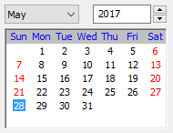

.. /////// 2017/04/27 - Hernan Dario Cano [dcanohdev@gmail.com]
.. // docs/classes/widgets/controls/calendar.rst
.. //  Class Font reference
.. //   (c) 2017 Hernan Dario Cano | Lide Framework License

.. _ClassCalendar:

Calendar
========
.. note::

  Calendar is derived from Control_ class.

The calendar control allows the user to pick a date.

The user can move the current selection using the keyboard and select the date (generating an event) by pressing <Intro> or double clicking it.

The general look of a control at runtime is demonstrated in the following picture:

----------------------------------------------------------------------------------------------------

Constructor
***********

Control class has a single constructor:

.. code-block:: lua

 Calendar:new { 
    object Parent, string Name, 
    number PosX, number PosY, 
    number Flags = CAL_SHOW_HOLIDAYS + CAL_MONDAY_FIRST
 }

Arguments
^^^^^^^^^

These arguments are received by class constructor.

============  ===========================================================================================
  Argument     Description
============  ===========================================================================================
 Name          The control name
 Parent        The control parent
 PosX          Position related to X
 PosY          Position related to Y
 Flags         Possible style modificators for Calendar control:

               =====================================  ==========  =====================================
                 constant                               value       description
               =====================================  ==========  =====================================
                ``CAL_SUNDAY_FIRST``                    ``0 ``      Show Sunday as the first day in the week
                ``CAL_MONDAY_FIRST``                    ``1 ``      Show Monday as the first day in the week
                ``CAL_SHOW_HOLIDAYS``                   ``2 ``      Highlight holidays in the calendar
                ``CAL_NO_YEAR_CHANGE``                  ``4 ``      Disable the year changing
                ``CAL_NO_MONTH_CHANGE``                 ``12``      Disable the month (and, implicitly, the year) changing
                ``CAL_SHOW_SURROUNDING_WEEKS``          ``32``      Show the neighbouring weeks in the previous and next months
                ``CAL_SEQUENTIAL_MONTH_SELECTION``      ``16``      Use alternative, more compact, style for the month and year selection controls.
               =====================================  ==========  =====================================

============  ===========================================================================================

------------------------------------------------------------------------------------------------------

Events
******

The following events are emitted by this class:

============================  =========================================================================
  Event name                    Description
============================  =========================================================================
 Calendar.onSelChanged_        When the selected date was changed.
 Calendar.onDoubleClicked_     When the selected day was changed.   
============================  =========================================================================

----------------------------------------------------------------------------------------------------

Inherited Methods
*****************

These methods are inherited from its super classes:

=====================  =============================================================================
  Class Method          Description
=====================  =============================================================================
 Object:getName_	       Returns control's name.
 Object:setName_	       Sets the control name.
 Widget:getParent_	     Returns control's parent.
 Widget:setParent_	     Sets the control parent.
 Widget:getPosX_	       Returns control's position related to X.
 Widget:setPosX_	       Sets the control position related to X.
 Widget:getPosY_	       Returns control's position related to Y.
 Widget:setPosY_	       Sets the control position related to Y.
 Widget:getEnabled_      Returns true if is enabled.
 Widget:setEnabled_      Set control enabled or disabled.
 Widget:getVisible_      Returns the control visibility.
 Widget:setVisible_      Returns the control visibility.
 Widget:getBind_         Returns a reference to the C++ control.
=====================  =============================================================================

----------------------------------------------------------------------------------------------------

Class Methods
*************

These methods are defined by this class.

------------------------------------------------------------------------------------------------------

Calendar:enableYearChange
^^^^^^^^^^^^^^^^^^^^^^^^^
   
  It allows or disallows the user to change the year interactively.

=========  =========================================================================================
 nil_       Calendar:enableYearChange( bool_ Enable = true )
=========  =========================================================================================

----------------------------------------------------------------------------------------------------

Calendar:enableMonthChange
^^^^^^^^^^^^^^^^^^^^^^^^^^
   
  It allows or disallows the user to change the month interactively. Note that if the month cannot be changed, the year cannot be changed neither.
  
    *Returns a boolean: true if the value of this option really changed or false if it was already set to the requested value*

=========  =========================================================================================
 bool_      Calendar:enableMonthChange( bool_ Enable = true )
=========  =========================================================================================

----------------------------------------------------------------------------------------------------

Calendar:enableHolidayDisplay
^^^^^^^^^^^^^^^^^^^^^^^^^^^^^
   
  It enables or disables the special highlighting of the holidays.

=========  =========================================================================================
 nil_       Calendar:enableHolidayDisplay( bool_ Display = true )
=========  =========================================================================================

----------------------------------------------------------------------------------------------------

.. // Required values for html docs visualization
.. include:: ../directives.rst